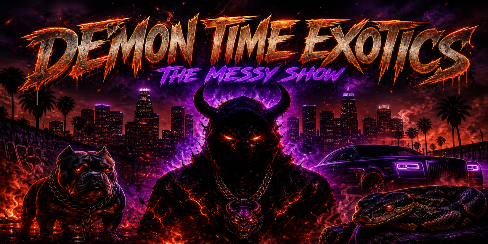

<div align="center">



# 💪🏾😈🔥 DEMON TIME EXOTICS — THE MESSY SHOW 🔥😈💪🏾

### The rawest, most unfiltered voice in Hip Hop News, Podcast Beef & Urban Entertainment

[](https://www.youtube.com/@DTEMONEY448)
[](https://www.youtube.com/@DTEMONEY448)
[](https://www.youtube.com/@DTEMONEY448)
[](https://instagram.com/dtemoney448)
[](https://twitch.tv/dtemoney448)
[](https://shopdemontimeexotics.com)

[](https://dtemoney448.github.io/demon-time-exotics/)
[](.github/workflows/ci.yml)
[](LICENSE)
[](CONTRIBUTING.md)

**No scripts. No filters. Just facts, jokes, and real talk.** 😈

<a href='https://ko-fi.com/YOUR_USERNAME' target='_blank'>
    
</a>

</div>

---

## 📺 What Is Demon Time Exotics?

**Demon Time Exotics (@DTEMONEY448)** is a Hip Hop news, podcast beef, and urban entertainment commentary brand covering viral drama, street politics, and industry controversies across **Los Angeles, Compton, South Central & the West Coast**.

| 📊 Metric | 🎯 Data |
|---|---|
| **Subscribers** | 21.2K |
| **Total Videos** | 406 |
| **Total Views** | 3,025,509 |
| **Joined** | Sep 28, 2022 |
| **Location** | United States |
| **Contact** | Bigmoney@demontimeexotics.com |

### 🔥 Content Pillars

- **Hip Hop News & Drama** — viral beefs, feuds, and controversies broken down FIRST
- **No Jumper Chaos** — Adam22, Wack 100, and everything adjacent
- **Podcast Beef** — conflicts between podcasters and personalities
- **Street Politics** — Compton, South Central & West Coast hip hop dynamics
- **Industry Exposés** — alleged backdoor deals, snitching allegations, scandals
- **Live Streams & Reactions** — daily unfiltered coverage of breaking drama

**If it's trending, controversial, or shaking the culture — we cover it FIRST.** 🗣️

---

## 🏗️ This Repository — One Repo, Every Platform

This monorepo contains the **entire DTE digital ecosystem** in a single repository:

| Target | Location | Tech | Output |
|---|---|---|---|
| 🌐 **Landing Site** | `apps/landing` | Vite + Vanilla TS | GitHub Pages |
| 🖥️ **Tauri Desktop** | `apps/tauri` | Tauri 2 + Rust | `.msi` `.dmg` `.AppImage` `.deb` |
| 🖥️ **Electron Desktop** | `apps/electron` | Electron 33 + Vite | `.exe` `.dmg` `.AppImage` `.snap` |
| 📱 **Mobile App** | `apps/mobile` | Expo / React Native | Android `.apk`/`.aab` + iOS |
| 🧩 **Shared UI** | `packages/ui` | TypeScript | Reusable components |
| ⚙️ **Core Logic** | `packages/core` | TypeScript | API, stores, types |
| 🤝 **Shared Utils** | `packages/shared` | TypeScript | Constants & helpers |
| 🎨 **Brand Assets** | `packages/assets` | PNG/SVG | Logos, icons, fonts |
| ⚙️ **Configs** | `packages/config` | — | ESLint, TS, Tailwind, Vite |

### 📁 Repository Structure

```
.
├── .github/            # Workflows, issue templates, discussions, funding
├── apps/
│   ├── landing/        # 🌐 Eye-catching GitHub Pages site
│   ├── tauri/          # 🖥️ Tauri desktop app
│   ├── electron/       # 🖥️ Electron desktop app
│   └── mobile/         # 📱 Expo / React Native app
├── packages/
│   ├── ui/             # Shared UI components
│   ├── core/           # Business logic / API / stores
│   ├── shared/         # Constants, helpers, types
│   ├── config/         # Shared ESLint/TS/Tailwind/Vite configs
│   └── assets/         # Branding, fonts, icons, images
├── tooling/            # Build scripts & code generators
├── docs/               # Architecture docs & screenshots
├── prompts/            # AI prompt templates
├── wiki/               # Wiki content source
└── discussion/         # Discussion templates & docs
```

---

## 🚀 Quick Start

### Prerequisites

| Tool | Version | Notes |
|---|---|---|
| **Node.js** | ≥ 20.18 | `nvm install` |
| **pnpm** | ≥ 9.12 | `corepack enable` |
| **Rust** | stable | Tauri only |
| **Xcode** | 15+ | iOS builds only (macOS) |
| **Android Studio** | latest | Android builds only |

### Install & Run

```bash
# 1. Clone
git clone https://github.com/DTEMONEY448/demon-time-exotics.git
cd demon-time-exotics

# 2. Install everything (all apps + packages)
pnpm install

# 3. Run any target
pnpm dev:landing    # 🌐 Landing site → http://localhost:5173
pnpm dev:tauri      # 🖥️ Tauri desktop (needs Rust)
pnpm dev:electron   # 🖥️ Electron desktop
pnpm dev:mobile     # 📱 Expo (press i/a for iOS/Android)

# Or run everything at once
pnpm dev
```

### Build Everything

```bash
pnpm build:landing    # → apps/landing/dist → GitHub Pages
pnpm build:tauri      # → apps/tauri/src-tauri/target/release/bundle
pnpm build:electron   # → apps/electron/release
pnpm build:mobile     # → apps/mobile/dist (Expo export)
```

Full setup details: [INSTALL.md](INSTALL.md) • Build reference: [BUILD.md](BUILD.md) • Releases: [DEPLOYMENT.md](DEPLOYMENT.md)

---

## 🔗 Official Links

| Platform | Link |
|---|---|
| 🎬 **YouTube (Main)** | [youtube.com/@DTEMONEY448](https://www.youtube.com/@DTEMONEY448) |
| 🎬 **YouTube (Backup)** | [youtube.com/@dteclips](https://www.youtube.com/@dteclips) |
| 📸 **Instagram** | [instagram.com/dtemoney448](https://instagram.com/dtemoney448) |
| 🎮 **Twitch** | [twitch.tv/dtemoney448](https://twitch.tv/dtemoney448) |
| 👕 **Merch** | [shopdemontimeexotics.com](https://shopdemontimeexotics.com) |
| 💰 **Membership** | [Join on YouTube](https://www.youtube.com/channel/UC4mSdocvseflT-Tubw9xOnw/join) |
| ✉️ **Email** | Bigmoney@demontimeexotics.com |

---

## 🤝 Support The Movement

**The shadowban is REAL — tap in and join the movement.** Every like, comment, and share counts.

<a href='https://ko-fi.com/YOUR_USERNAME' target='_blank'>
    
</a>

- 🎬 **Subscribe & turn on ALL alerts** 🔔 → [YouTube](https://www.youtube.com/@DTEMONEY448)
- 💎 **Become a MEMBER** → [Join](https://www.youtube.com/channel/UC4mSdocvseflT-Tubw9xOnw/join)
- 👕 **Cop the merch** → [shopdemontimeexotics.com](https://shopdemontimeexotics.com)
- 🎁 **Affiliate tech** (gimbals, mics, cameras used by the show) — see channel description

---

## 📚 Documentation

| Doc | Purpose |
|---|---|
| [INSTALL.md](INSTALL.md) | Environment setup for every platform |
| [BUILD.md](BUILD.md) | Build system deep-dive |
| [DEPLOYMENT.md](DEPLOYMENT.md) | Release & deployment pipeline |
| [CHANGELOG.md](CHANGELOG.md) | Version history |
| [ROADMAP.md](ROADMAP.md) | Where this is heading |
| [USAGE.md](USAGE.md) | Using the apps & site |
| [FAQ.md](FAQ.md) | Common questions |
| [SUPPORT.md](SUPPORT.md) | Getting help |
| [CONTRIBUTING.md](CONTRIBUTING.md) | How to contribute |
| [CODE_OF_CONDUCT.md](CODE_OF_CONDUCT.md) | Community rules |
| [SECURITY.md](SECURITY.md) | Security policy |
| [GOVERNANCE.md](GOVERNANCE.md) | Project governance |
| [ADR.md](ADR.md) | Architecture decision records |
| [SUMMARY.md](SUMMARY.md) | Channel & repo summary |
| [docs/](docs/) | Full documentation hub |
| [wiki/](wiki/) | Wiki content source |
| [prompts/](prompts/) | AI prompt templates for repo work |
| [discussion/](discussion/) | Discussions templates & seeded threads |

---

## 🛠️ Tech Stack


---

## ⭐ Show Love

If this repo helped you build a multi-platform empire from one codebase:

**Drop a ⭐ • Fork it • Build your own Messy empire** 😈🔥

<div align="center">

**DEMON TIME EXOTICS © 2025** • Los Angeles, California 🌴

*No scripts. No filters. Just facts, jokes, and real talk.* 💪🏾😈🔥

</div>
